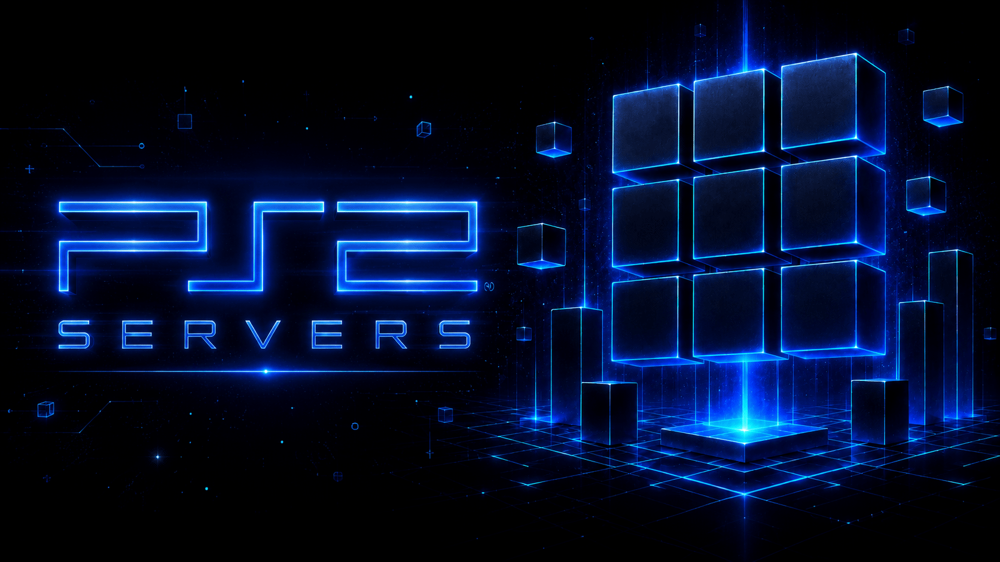

<p align="center">
  
</p>

# PS2-Servers

Network servers for loading PlayStation 2 games and apps over a LAN with
[Open PS2 Loader](https://github.com/ps2homebrew/Open-PS2-Loader) (OPL) and forks —
plus a small **GUI launcher** so anyone can run them without touching a terminal.

## Quick start — the launcher

The launcher lets you pick a server, choose your games folder, and click **Start**.
It detects your PC's LAN IP and shows the exact settings to enter in OPL.

- **Packaged app (no Python needed):** double-click **`PS2Servers`** (`.exe` on
  Windows) — see [Build the app](#build-the-single-file-app) to produce it.
- **From source:** double-click **`Start-Launcher.bat`** (Windows) or run
  `./start-launcher.sh` (Linux/macOS). Requires Python 3.

The launcher starts normally without administrator rights. The GUI shows whether
it is currently running as administrator and includes a **Restart as administrator**
button for the few Windows setup actions that actually need elevation.

The GUI uses a lightweight PS2-themed Tkinter skin. It does not use Electron,
Qt, a browser view, or any heavy UI framework.

## Windows security note

PS2 Servers is an unsigned open-source network tool. Because it runs local server
processes and may ask Windows Firewall to allow inbound LAN traffic, some
antivirus products may flag the packaged Windows EXE heuristically.

The SMBv1/RiptOPL server does **not** enable Windows' built-in SMB1 optional
feature tree. It speaks the OPL-compatible SMB1/CIFS subset itself and normally
listens on custom TCP port `1445`; OPL connects to this program directly.

Windows setup is intentionally narrow:

- no automatic enabling of Windows SMB1;
- no disabling of SMB1 automatic removal;
- Windows Firewall changes are limited to rules named `PS2 Servers - ...`;
- firewall allow/cleanup can be handled from the GUI without a terminal;
- administrator rights are requested only for firewall changes or advanced port
  `445` mode;
- advanced port `445` mode is optional and temporarily pauses Windows File
  Sharing only while that server mode is running.

Normal custom-port SMB mode, UDPFS, UDPBD, folder browsing, and logs do not need
the whole launcher to run as administrator. Keeping the default launch non-admin
reduces the blast radius of bugs and keeps the app easier to trust.

See [SECURITY.md](SECURITY.md) for verification, cleanup, and reporting details.

## What's inside

All three servers are pure-Python (standard library) and run on Windows, Linux and macOS.

| Folder | Server | What it does |
|--------|--------|--------------|
| [`smbv1_server/`](smbv1_server/) | **SMBv1 (RiptOPL)** | Shares a games folder over SMB — works even on Windows 11 where the OS removed SMB1. |
| [`udpfs_server/`](udpfs_server/) | **UDPFS** | Serves a folder and/or disk image over UDP; can transparently decompress CHD/CSO/ZSO. |
| [`udpbd_server/`](udpbd_server/) | **UDPBD** | Serves a disk image as a block device over UDP; the PS2 auto-discovers it. |

`udpbd_server/udpbd_server.py` is a pure-Python port of Rick Gaiser's UDPBD server —
see [its provenance](udpbd_server/SOURCE.md). UDPBD has largely been superseded by UDPFS.

## Optional compressed-image support

UDPFS can expose compressed images as `.iso` files when compression support is
available.

The launcher includes a **Compression support** panel so users do not need to use
a terminal for the common checks:

- **Check** reports whether ZSO/LZ4 and CHD support are available.
- **Install ZSO/LZ4 support** installs the Python `lz4` package when running from
  source.
- **CHD/libchdr help** shows platform-specific guidance for installing or making
  `libchdr` available.

Packaged single-file builds cannot install Python packages into themselves. If a
release should have always-on ZSO support, bundle `lz4` at build time. CHD support
uses native `libchdr`, so the launcher shows guidance instead of silently placing
DLLs or changing system packages.

## Run a server on its own (terminal)

Each server still runs standalone, and the launcher can run them too:

```sh
python smbv1_server/smbserver_opl.py --share games=D:/PS2Games
python udpfs_server/udpfs_server.py  -d D:/PS2Games --enable-compression
python udpbd_server/udpbd_server.py  D:/PS2Games/game.iso
# or, via the launcher engine:
python -m launcher --serve udpfs -d D:/PS2Games
python -m launcher --list            # show servers available on this machine
```

## Build the single-file app

[Nuitka](https://nuitka.net) bundles the launcher and all three servers into one
executable per OS — no Python install required for the end user:

```sh
python -m pip install -r requirements-build.txt
python build/build.py            # -> dist/PS2Servers(.exe)
```

## Release verification

Automatic releases include `SHA256SUMS.txt`, a portable source ZIP, and GitHub
artifact attestations for the packaged assets. Example verification:

```sh
sha256sum -c SHA256SUMS.txt
gh attestation verify PS2Servers-windows-x64.exe -R NathanNeurotic/PS2-Servers
```

Checksums prove the file was downloaded intact. Attestations prove build
provenance. Neither is a magic safety certificate; if you want the lowest-trust
path, inspect and run from source.

## Status

The UDPBD port is validated by `udpbd_server/selftest.py` at the protocol level
(INFO/READ/WRITE byte-for-byte). As with the SMBv1 server, **final validation is on
real hardware** — an actual PS2 running OPL, or PCSX2 with a network adapter.

## License and notices

PS2 Servers is licensed under the **Academic Free License 3.0 (AFL-3.0)**. See
[`LICENSE`](LICENSE).

This repository also includes third-party notices and provenance details in
[`NOTICE.md`](NOTICE.md), including the redistributed Neutrino UDPFS server,
UDPBD protocol references, optional compression libraries, build tooling, and
trademark notes.

## Credits & thanks

This is a fan project that stands entirely on the shoulders of the PS2 homebrew
community. None of the clever parts are ours — we just wrapped brilliant existing
work in something click‑and‑go. With genuine gratitude:

- **Rick Gaiser — [@rickgaiser](https://github.com/rickgaiser)** — the heart of all
  of this. He designed the **UDPBD** and **UDPFS** network protocols and wrote the
  original servers, alongside **[Neutrino](https://github.com/rickgaiser/neutrino)**.
  [`udpfs_server/udpfs_server.py`](udpfs_server/udpfs_server.py) is his UDPFS server
  (from Neutrino's `pc/` host tools), and
  [`udpbd_server/udpbd_server.py`](udpbd_server/udpbd_server.py) is our independent
  Python re‑implementation of his UDPBD v2 protocol. The network game‑loading here
  simply does not exist without his work — thank you.
- **El_isra — [@israpps](https://github.com/israpps)** — maintains the canonical
  **[udpbd-server](https://github.com/israpps/udpbd-server)** on GitHub (Rick's code,
  with CI), which is the reference we ported from.
- **Alex Parrado** — the Windows port of udpbd-server.
- **[Open PS2 Loader](https://github.com/ps2homebrew/Open-PS2-Loader)** and the
  **[ps2homebrew](https://github.com/ps2homebrew)** team — the loader everything here
  serves, and the wider toolchain that makes PS2 homebrew possible.
- **[prodeveloper0/pyudpbd](https://github.com/prodeveloper0/pyudpbd)** — a pure‑Python
  UDPBD port we read while writing our own.
- The folks behind **CHD ([libchdr](https://github.com/rtissera/libchdr) / MAME)**,
  **CSO**, and **ZSO** — the compressed‑image formats UDPFS decompresses on the fly.

### What's original here

The **GUI launcher**, the **RiptOPL** SMBv1 server, and the **pure‑Python UDPBD port**
were written for this repo. Everything at the protocol level is the community's —
we reimplemented from public protocols/source (rather than copying code) where we
could, and tried to attribute accurately.

### To the authors above 🙏

This exists out of appreciation for what you've given the PS2 scene, not any sense of
ownership. If you'd like attribution changed, a link corrected, or your work removed
from this repo entirely, please [open an issue](../../issues) — we'll sort it out
right away, no questions asked. Thank you, sincerely.
